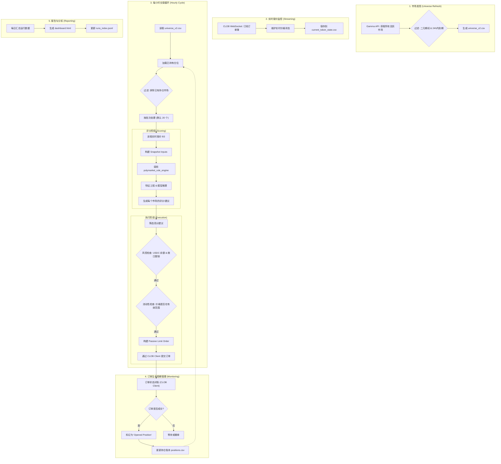

# Execution Engine 完整流程图

该流程图描述了 `execution_engine` 从市场发现、数据采集到模型评分及最终执行订单的完整自动化交易生命周期。

## 关键模块说明

- **Universe Refresh**: `execution_engine/online/universe/refresh.py`。负责维护可交易市场的“底池”。
- **Streaming Manager**: `execution_engine/online/streaming/manager.py`。通过 WebSocket 维持对订单簿的最佳买卖价监控。
- **Hourly Cycle**: `execution_engine/online/pipeline/cycle.py`。整个流水线的调度者。
- **Scoring**: `execution_engine/online/scoring/hourly.py`。负责将原始数据转换为模型输入并获取预测评分。
- **Execution Submission**: `execution_engine/online/execution/submission.py`。负责订单的合规性检查、定价（通常为 best_bid - 1 tick）和实际发送。
- **Order Monitoring**: `execution_engine/online/execution/monitor.py`。负责维护本地持仓状态与链上订单状态的同步。
